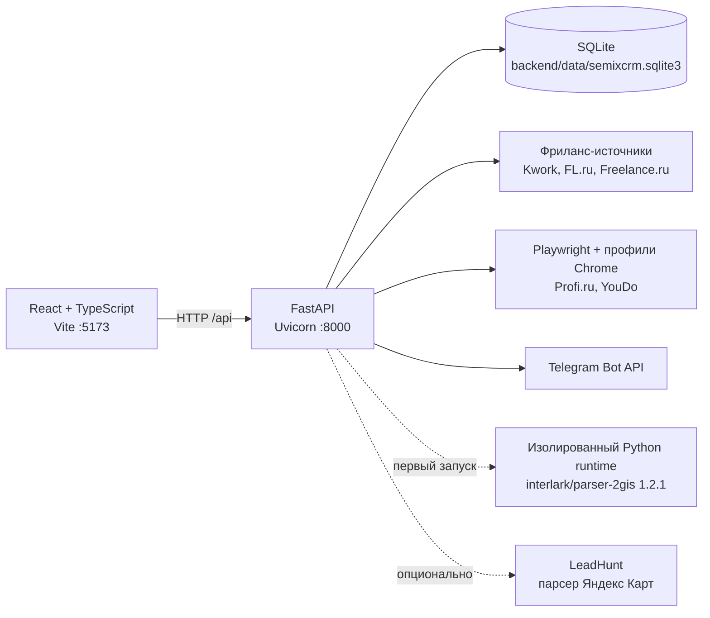

# Semix CRM

Локальная персональная CRM для управления проектами, поиском работы, фриланс-заказами, расписанием и базой потенциальных клиентов. Приложение объединяет React-интерфейс, FastAPI API и локальную SQLite-базу; для сбора данных может подключать внешние парсеры и браузерные профили.

> **Статус проекта:** локальный MVP с русскоязычным интерфейсом. Расписание, база клиентов и фриланс-модуль сохраняют данные через API. Разделы проектов и вакансий пока работают как интерактивные демонстрационные экраны, а общие настройки ещё не реализованы.

## Что умеет проект

| Раздел | Возможности | Состояние данных |
|---|---|---|
| Главная | Навигация, поиск по разделам, инструкция, светлая и тёмная темы | Метрики демонстрационные; тема сохраняется в `localStorage` |
| Мои проекты | Карточки, поиск, фильтры, сортировка, локальное добавление проекта | Демо-данные и React state; после перезагрузки изменения исчезают |
| Работа (вакансии) | Список вакансий, поиск и фильтры, интерфейс добавления | Статические демо-данные; сохранение в backend не подключено |
| Фриланс | Заказы, статусы, заметки, архив, фильтры, история запусков, снайпер источников, Telegram | Рабочий API и SQLite |
| Расписание | Недельные задачи и встречи, заметки по дням, цели и итоги недели, статистика | Рабочий API и SQLite |
| Волк с Уолл-стрит | Ручные и найденные клиенты, этапы продаж, lead scoring, архив, история парсинга | Рабочий API и SQLite; 2GIS настраивается автоматически, Яндекс Карты требуют LeadHunt |
| Настройки | Пункт навигации и экран-заглушка | Не реализовано |

Интерфейс адаптивный, поддерживает тёмную тему и не использует отдельный frontend-router: активный раздел переключается внутри одного React-приложения.

## Архитектура



Backend предоставляет 35 прикладных API-маршрутов. При старте он создаёт или обновляет схему SQLite, восстанавливает настройки фриланс-снайпера и запускает его фоновый поток, если снайпер был включён ранее.

## Технологии

### Frontend

- React 19;
- TypeScript;
- Vite 8;
- Lucide React;
- обычный CSS без UI-фреймворка.

### Backend

- Python и FastAPI;
- Uvicorn;
- SQLite из стандартной библиотеки Python;
- Pydantic;
- HTTPX и Beautiful Soup;
- Playwright для источников, требующих браузерную сессию.

## Требования

- Windows — основной и проверенный сценарий запуска;
- Node.js `^20.19.0` или `>=22.12.0` — это требование зафиксированной версии Vite;
- Python 3.13 — версия, на которой проверен текущий backend;
- Google Chrome — для 2GIS;
- Google Chrome либо установленный Chromium Playwright — для браузерных фриланс-источников;
- Git — для клонирования репозитория.

Для базовой CRM внешние парсеры не нужны. Движок 2GIS устанавливается автоматически при первом поиске клиентов. Для Яндекс Карт по-прежнему требуется внешний проект LeadHunt.

## Быстрый запуск

Команды ниже предназначены для PowerShell.

```powershell
git clone https://github.com/Lobanovs/SemixCRM.git
cd SemixCRM

npm install

py -3 -m venv backend\.venv
backend\.venv\Scripts\python.exe -m pip install -r backend\requirements.txt

npm run dev
```

После запуска доступны:

- frontend: <http://127.0.0.1:5173>;
- backend: <http://127.0.0.1:8000>;
- Swagger UI: <http://127.0.0.1:8000/docs>;
- проверка API: <http://127.0.0.1:8000/api/health>.

`npm run dev` запускает frontend и backend вместе. Если порт `8000` уже занят работающим Semix CRM API, скрипт использует существующий процесс. Если порт `5173` занят другим приложением, Vite завершится с ошибкой из-за режима `strictPort`.

### Отдельный запуск сервисов

```powershell
npm run dev:frontend
npm run dev:backend
```

Эти команды нужно выполнять в разных терминалах. Скрипт `dev:backend` использует `backend\.venv`, поэтому виртуальное окружение необходимо создать заранее.

## Переменные окружения

Файл [.env.example](.env.example) содержит шаблон локальных значений. `.env`, SQLite, cookies и браузерные профили исключены из Git.

> **Важно:** текущий backend не вызывает `load_dotenv()` и `npm run dev` не передаёт Uvicorn параметр `--env-file`. Простого копирования `.env.example` в `.env` недостаточно для backend-переменных. Перед запуском задайте их в PowerShell либо запускайте Uvicorn вручную с `--env-file .env`.

Пример для текущей PowerShell-сессии:

```powershell
$env:TELEGRAM_BOT_TOKEN = "token-from-botfather"
$env:TELEGRAM_ALLOWED_CHAT_ID = "your-chat-id"
npm run dev
```

| Переменная | Назначение | Значение по умолчанию |
|---|---|---|
| `VITE_API_BASE_URL` | Адрес backend для frontend | `http://127.0.0.1:8000` |
| `SEMIXCRM_DB_PATH` | Альтернативный путь к SQLite | `backend/data/semixcrm.sqlite3` |
| `TELEGRAM_BOT_TOKEN` | Токен бота для уведомлений о новых заказах | пусто |
| `TELEGRAM_ALLOWED_CHAT_ID` | Единственный разрешённый получатель уведомлений | пусто в коде |
| `FREELANCE_BROWSER_PROFILE` | Корень постоянных браузерных профилей | `backend/data/freelance_browser` |
| `FREELANCE_BROWSER_CHANNEL` | Канал Playwright, обычно `chrome` | `chrome` |
| `FREELANCE_CHROME_PATH` | Явный путь к Chrome/Chromium | автоопределение |
| `FREELANCE_KWORK_URL` | Переопределение ленты Kwork | публичная лента Kwork |
| `FREELANCE_FL_URL` | Переопределение ленты FL.ru | публичная лента FL.ru |
| `FREELANCE_FREELANCE_RU_URL` | Переопределение ленты Freelance.ru | публичная лента Freelance.ru |
| `FREELANCE_PROFI_URL` | Переопределение страницы Profi.ru | backoffice Profi.ru |
| `FREELANCE_YOUDO_URL` | Переопределение страницы YouDo | список заданий YouDo |
| `FREELANCE_YOUDO_MAX_TASKS` | Максимум карточек YouDo за одну проверку | `500` |
| `PARSER2GIS_RUNTIME_DIR` | Каталог изолированного окружения 2GIS | `backend/data/parser2gis-runtime` |
| `PARSER2GIS_PYTHON` | Готовый Python с `parser-2gis==1.2.1` вместо автоустановки | пусто |
| `PARSER2GIS_HEADLESS` | Режим браузера 2GIS; `no` устойчивее к CAPTCHA | `no` |
| `LEADHUNT_ROOT` | Путь к внешнему проекту LeadHunt для Яндекс Карт | `C:\Users\Admin\Desktop\LeadHunt` |
| `LEADHUNT_PYTHON` | Python для внешнего парсера Яндекс Карт | `py -3` или текущий Python |
| `LEADHUNT_BROWSER_HEADLESS` | Режим браузера Яндекс Карт | `true` |

`FREELANCE_POLL_INTERVAL_SECONDS` присутствует в `.env.example`, но текущий код его не читает. Интервал снайпера хранится в SQLite, меняется в интерфейсе и ограничен диапазоном 30–3600 секунд.

## Хранение данных

По умолчанию база создаётся в `backend/data/semixcrm.sqlite3`. В ней находятся:

- клиенты, контакты, статусы, архив и ключи дедупликации;
- настройки и история запусков клиентского парсера;
- неизменяемые снимки результатов каждого запуска;
- задачи, заметки, цели и итоги недель;
- фриланс-заказы, настройки снайпера и состояния источников;
- история проверок и факты отправки Telegram-уведомлений.

Каталог `backend/data/` исключён из Git. Для резервной копии остановите backend и скопируйте SQLite-файл вместе с нужными браузерными профилями.

## Парсер клиентов

Раздел «Волк с Уолл-стрит» принимает публичные карточки компаний из 2GIS и Яндекс Карт, нормализует контакты, вычисляет качество лида, объединяет дубли и сохраняет результат в SQLite.

Основные параметры находятся прямо в правой панели: город, ниши, источники, стартовая страница 2GIS и лимит. Кнопка «Сохранить настройки» записывает текущие значения в backend. «Запустить парсер» сначала сохраняет актуальные параметры и только после успешного ответа запускает фоновую задачу, поэтому поиск не может случайно стартовать со старыми настройками. Длинный список ниш открывается отдельным компактным диалогом.

### Как определяется дубль

Приоритет идентификации:

1. ID карточки 2GIS или Яндекс Карт из URL;
2. нормализованные название, город и адрес;
3. название и город, если адрес отсутствует;
4. телефон;
5. домен сайта.

Повторно найденная компания не создаёт новую запись: доступные контакты и более полные поля объединяются, а статус продаж сохраняется. История запуска при этом содержит снимок результата с исходом `inserted` или `duplicate`.

### Как считаются очки лида

Максимум — 23 очка:

- нет полноценного сайта: `+5`;
- есть телефон: `+2`;
- рейтинг выше 4,0: `+2`;
- больше 30 отзывов: `+3`;
- есть Telegram, WhatsApp или e-mail при отсутствии сайта: `+4`;
- несколько филиалов: `+4`;
- ниша с высоким средним чеком: `+3`.

Процент соответствия равен отношению набранных очков к максимуму.

### Как работает 2GIS

Интеграция использует официальный CLI [interlark/parser-2gis](https://github.com/interlark/parser-2gis) версии 1.2.1. При первом поиске Semix CRM автоматически:

1. создаёт отдельное окружение `backend/data/parser2gis-runtime`;
2. устанавливает туда `parser-2gis==1.2.1`;
3. открывает поиск 2GIS в Google Chrome;
4. принимает JSON с карточками и нормализует название, адрес, телефоны, сайт, соцсети, рейтинг, отзывы и URL карточки.

Отдельное окружение необходимо из-за зависимостей: upstream использует Pydantic 1.x, а FastAPI-часть Semix CRM — Pydantic 2.x. Каталог runtime находится внутри `backend/data/` и не попадает в Git. Для первой установки нужен интернет; последующие запуски используют уже готовое окружение.

По умолчанию используется видимый Chrome (`PARSER2GIS_HEADLESS=no`). Это обязательная практическая настройка: 2GIS может отправлять автоматический headless-браузер на CAPTCHA и возвращать пустой результат. Semix CRM не обходит CAPTCHA. Если задан `PARSER2GIS_PYTHON`, в этом Python уже должен импортироваться `parser_2gis` версии 1.2.1.

Upstream поддерживает JSON, CSV и XLSX; Semix CRM использует JSON. Движок распространяется по лицензии LGPL-3.0.

### Яндекс Карты

Мост `backend/yandex_runner.py` импортирует `app.parser.yandex_maps_parser` и настройки браузера из внешнего проекта LeadHunt. Поэтому источник Яндекс Карт также не работает из чистого клона SemixCRM без установленного `LEADHUNT_ROOT`.

Отсутствие внешних парсеров не мешает вручную добавлять клиентов и использовать остальные модули CRM.

## Фриланс-снайпер

Модуль собирает и хранит реальные заказы из пяти независимо включаемых источников:

| Источник | Способ получения | Нужен ручной вход |
|---|---|---|
| Kwork | HTTP и встроенное состояние страницы | Нет |
| FL.ru | HTTP и HTML | Нет |
| Freelance.ru | HTTP и HTML | Нет |
| Profi.ru | Playwright, lazy-scroll и постоянный профиль | Да |
| YouDo | Playwright, кнопка «Показать ещё» и постоянный профиль | Да |

Для закрытых площадок откройте «Фриланс → Настроить → Войти», войдите самостоятельно и закройте окно. Для каждого источника используется отдельный профиль в `backend/data/freelance_browser/<source>`. CRM не хранит пароли в исходном коде и не обходит CAPTCHA.

Profi.ru загружается до стабилизации списка заказов. YouDo сначала проверяется в headless-режиме, а при ответе `403` автоматически повторяется в видимом свёрнутом Chrome с сохранённой сессией; карточки подгружаются до `FREELANCE_YOUDO_MAX_TASKS`. Публичные источники повторяют только временные сетевые ошибки и не маскируют ошибки HTTP или разбора страницы.

Снайпер:

- работает только пока запущен локальный backend;
- проверяет источники последовательно и изолирует их ошибки;
- устраняет дубли по источнику и внешнему ID, затем по URL или заголовку с датой;
- сохраняет историю запусков и набор найденных заказов;
- рассчитывает объяснимую релевантность по ключевым словам и бюджету;
- показывает отдельные состояния «нет новых», «требуется вход», «доступ ограничен» и «ошибка» с действием восстановления;
- отправляет каждый новый заказ в разрешённый Telegram chat не более одного раза.

Ключевые слова, исключающие слова и минимальный бюджет сейчас влияют на оценку релевантности, но не являются жёстким фильтром сохранения: заказ с нулевой оценкой всё равно может попасть в базу. Автоматическая отправка откликов не реализована.

Если на компьютере нет Google Chrome, установите Chromium для Playwright:

```powershell
backend\.venv\Scripts\python.exe -m playwright install chromium
```

## API

Полная интерактивная схема доступна в Swagger UI по адресу <http://127.0.0.1:8000/docs>.

| Группа | Основные маршруты |
|---|---|
| Состояние | `GET /api/health` |
| Клиенты | `GET/POST /api/clients`, изменение статуса, архивирование и восстановление |
| Парсер клиентов | настройки, запуск фоновой задачи, polling состояния, история и снимки запусков |
| Расписание | получение недели, CRUD задач, заметки по дням, итоги и цели недели |
| Фриланс | CRUD и архив заказов, настройки, состояния источников, вход, управление снайпером и история |

Backend разрешает CORS только для `localhost:5173` и `127.0.0.1:5173`.

## Команды разработки

| Команда | Назначение |
|---|---|
| `npm run dev` | Запустить frontend и backend вместе |
| `npm run dev:frontend` | Запустить только Vite на `127.0.0.1:5173` |
| `npm run dev:backend` | Запустить только Uvicorn на `127.0.0.1:8000` |
| `npm run test:frontend` | Запустить компонентные тесты frontend |
| `npm run build` | Проверить TypeScript и собрать production frontend |
| `npm run preview` | Открыть собранный frontend на `127.0.0.1:4173` |

## Тестирование

Frontend:

```powershell
npm run test:frontend
npm run build
```

Backend:

```powershell
backend\.venv\Scripts\python.exe -m unittest discover -s backend\tests -v
```

Frontend-тесты проверяют видимость стартовой страницы 2GIS, сохранение параметров, порядок `PUT → POST` при запуске и остановку запуска при ошибке сохранения. Backend-тесты покрывают SQLite, архив и восстановление, расписание, дедупликацию, API фриланса, адаптеры источников, Telegram, управление снайпером, историю запусков и автоматическую подготовку изолированного 2GIS-runtime.

Live-проверки сайтов фриланса и карт не подменяются тестовыми данными и зависят от доступности площадок, их текущей HTML-структуры, авторизованных сессий и ограничений доступа.

## Структура проекта

```text
SemixCRM/
├── backend/
│   ├── freelance/          # модели, scoring, адаптеры, Playwright и Telegram
│   ├── tests/              # unittest и HTML-fixtures
│   ├── database.py         # схема SQLite, миграции и запросы
│   ├── lead_utils.py       # нормализация, дедупликация и lead scoring
│   ├── main.py             # FastAPI и фоновые задачи
│   ├── parser.py           # интеграция 2GIS и Яндекс Карт
│   ├── parser2gis_runtime.py       # установка и запуск upstream-парсера
│   ├── parser2gis-requirements.txt # изолированные зависимости 2GIS
│   └── yandex_runner.py    # мост к внешнему LeadHunt
├── design-system/          # правила визуального языка Semix CRM
├── docs/superpowers/       # проектные спецификации и планы
├── scripts/dev.mjs         # совместный запуск frontend/backend
├── src/
│   ├── components/         # общие UI-компоненты
│   ├── pages/              # разделы CRM
│   ├── App.tsx             # оболочка и навигация
│   └── styles.css          # светлая/тёмная темы и адаптивная вёрстка
├── .env.example
├── package.json
└── tsconfig.json
```

## Известные ограничения

- проект рассчитан на локальную работу одного пользователя;
- в API нет входа, ролей и разграничения доступа;
- нет облачного развёртывания, Docker-конфигурации и CI;
- проекты и вакансии пока не сохраняются;
- общая статистика главной страницы демонстрационная;
- страница общих настроек — заглушка;
- Яндекс Карты зависят от локального проекта LeadHunt вне репозитория;
- сбор данных может перестать работать после изменения HTML или защиты внешней площадки;
- фриланс-снайпер прекращает работу после остановки backend;
- `.env` для backend не загружается автоматически;
- лицензия самого SemixCRM в репозитории пока не указана.

## Безопасность

- Не публикуйте `TELEGRAM_BOT_TOKEN`, cookies, SQLite и каталоги браузерных профилей.
- Если токен когда-либо попал в Git или чат, отзовите его через BotFather и выпустите новый.
- Не открывайте порт backend в интернет: API не имеет аутентификации.
- Используйте парсеры в соответствии с правилами площадок и применимым законодательством.
- Приложение не должно автоматически обходить CAPTCHA или защитные ограничения.

## Используемый upstream-проект

Интеграция 2GIS основана на [interlark/parser-2gis](https://github.com/interlark/parser-2gis) — открытом Python-парсере карточек организаций 2GIS. Его исходный код и производные изменения регулируются лицензией LGPL-3.0 upstream-проекта.
