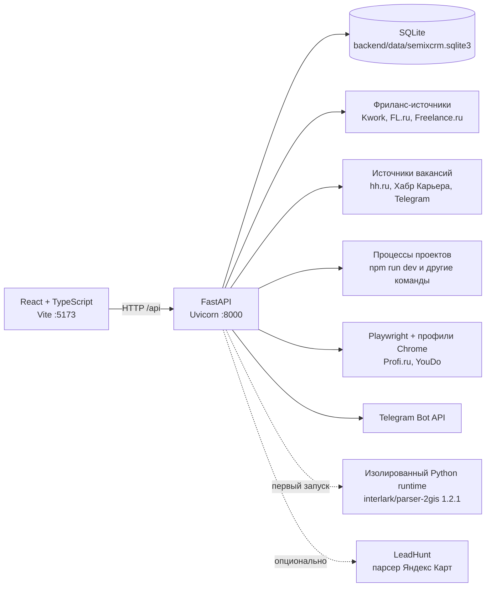

# Semix CRM

Локальная персональная CRM для управления проектами, поиском работы, фриланс-заказами,
расписанием, полезными рабочими ресурсами и базой потенциальных клиентов. Приложение
объединяет React-интерфейс, FastAPI API и локальную SQLite-базу; для сбора данных может
подключать внешние парсеры и браузерные профили.

> **Статус проекта:** локальный MVP с русскоязычным интерфейсом. Все содержательные разделы сохраняют данные через API в SQLite. В разделе настроек можно подключить OpenCode Go для AI-сообщений клиентам.

## Что умеет проект

| Раздел | Возможности | Состояние данных |
|---|---|---|
| Главная | Навигация, поиск по разделам, встроенная инструкция, светлая и премиальная чёрная темы | Метрики считаются по живым данным разделов; тема сохраняется в `localStorage` |
| Мои проекты | Карточки проектов, автоопределение по папке, запуск и остановка процесса, лог запуска, обнаруженный адрес, поиск и фильтры | Рабочий API и SQLite; запущенные процессы живут внутри backend |
| Работа (вакансии) | Трекер откликов с этапами, заметки, архив, фильтры, сбор вакансий с hh.ru, Хабр Карьеры и Telegram-каналов, объяснимая релевантность | Рабочий API и SQLite |
| Фриланс | Заказы, статусы, заметки, архив, фильтры, история запусков, снайпер источников, Telegram | Рабочий API и SQLite |
| Расписание | Недельные задачи и встречи, заметки по дням, цели, итоги и проверяемый AI-черновик недели | Рабочий API и SQLite; AI использует OpenCode Go |
| Полезные вещи | Каталог промптов, сайтов, магазинов, статей и других ресурсов со вкладками, поиском и CRUD | Рабочий API и SQLite |
| Волк с Уолл-стрит | Ручные и найденные клиенты, этапы продаж, lead scoring, архив, история парсинга | Рабочий API и SQLite; 2GIS настраивается автоматически, Яндекс Карты требуют LeadHunt |
| Настройки | Ключ OpenCode Go, выбор модели, таймаут, проверка подключения и удаление ключа | Рабочий API и локальное хранение в SQLite |

Интерфейс адаптивный, поддерживает премиальную чёрную тему с графитовыми поверхностями и холодными синими акцентами и не использует отдельный frontend-router: активный раздел переключается внутри одного React-приложения. Выбранная тема сохраняется между запусками.

## Встроенная инструкция

В каждом разделе под заголовком есть блок «Как пользоваться» — пошаговая инструкция
с теми же иконками и подписями кнопок, что и в самом интерфейсе. При первом заходе
в раздел блок раскрывается сам, дальше открывается по кнопке; отметка о просмотре
хранится в `localStorage` под ключом `semix-crm-guide-seen:<раздел>`.

Кнопка «Показать на экране» внутри блока запускает тур: он подсвечивает реальные
элементы страницы по очереди и объясняет каждый. Тур привязан не к CSS-классам,
а к атрибутам `data-guide` в разметке — правка вёрстки его не ломает. Шаги, элементов
которых нет на странице (например, кнопка «Открыть» у незапущенного проекта),
пропускаются автоматически. Закрывается по Escape, листается стрелками.

Тексты инструкций лежат в [src/guides.ts](src/guides.ts), сам компонент —
в [src/components/PageGuide.tsx](src/components/PageGuide.tsx). Чтобы добавить шаг,
допишите объект в нужный массив и, если шаг про конкретную кнопку, поставьте ей
`data-guide="..."`.

## Архитектура



Backend предоставляет 72 прикладные API-операции на 54 маршрутах. При старте он создаёт или обновляет схему SQLite, восстанавливает настройки фриланс-снайпера и запускает его фоновый поток, если снайпер был включён ранее. При остановке backend гасит все процессы проектов, которые запускал.

## Технологии

### Frontend

- React 19;
- TypeScript;
- Vite 8;
- Lucide React;
- обычный CSS без UI-фреймворка.

### Backend

- Python и FastAPI;
- Uvicorn;
- SQLite из стандартной библиотеки Python;
- Pydantic;
- HTTPX и Beautiful Soup;
- Playwright для источников, требующих браузерную сессию.

## Требования

- Windows — основной и проверенный сценарий запуска;
- Node.js `^20.19.0` или `>=22.12.0` — это требование зафиксированной версии Vite;
- Python 3.13 — версия, на которой проверен текущий backend;
- Google Chrome — для 2GIS;
- Google Chrome либо установленный Chromium Playwright — для браузерных фриланс-источников;
- Git — для клонирования репозитория.

Для базовой CRM внешние парсеры не нужны. Движок 2GIS устанавливается автоматически при первом поиске клиентов. Для Яндекс Карт по-прежнему требуется внешний проект LeadHunt.

## Быстрый запуск

Команды ниже предназначены для PowerShell.

```powershell
git clone https://github.com/Lobanovs/SemixCRM.git
cd SemixCRM

npm install

py -3 -m venv backend\.venv
backend\.venv\Scripts\python.exe -m pip install -r backend\requirements.txt

npm run dev
```

После запуска доступны:

- frontend: <http://127.0.0.1:5173>;
- backend: <http://127.0.0.1:8000>;
- Swagger UI: <http://127.0.0.1:8000/docs>;
- проверка API: <http://127.0.0.1:8000/api/health>.

Vite не следит за `backend/data` и `backend/.venv`: там лежат живые профили Chrome,
SQLite и рантайм парсера. Заблокированный временный файл Chrome ронял watcher
с ошибкой `EBUSY`, а вместе с ним и весь дев-сервер. Исключения заданы
в [vite.config.ts](vite.config.ts).

`npm run dev` запускает frontend и backend вместе. Если порт `8000` уже занят работающим Semix CRM API, скрипт использует существующий процесс. Если порт `5173` занят другим приложением, Vite завершится с ошибкой из-за режима `strictPort`.

### Отдельный запуск сервисов

```powershell
npm run dev:frontend
npm run dev:backend
```

Эти команды нужно выполнять в разных терминалах. Скрипт `dev:backend` использует `backend\.venv`, поэтому виртуальное окружение необходимо создать заранее.

## Переменные окружения

Файл [.env.example](.env.example) содержит шаблон локальных значений. `.env`, SQLite, cookies и браузерные профили исключены из Git.

> **Важно:** текущий backend не вызывает `load_dotenv()` и `npm run dev` не передаёт Uvicorn параметр `--env-file`. Простого копирования `.env.example` в `.env` недостаточно для backend-переменных. Перед запуском задайте их в PowerShell либо запускайте Uvicorn вручную с `--env-file .env`.

Пример для текущей PowerShell-сессии:

```powershell
$env:TELEGRAM_BOT_TOKEN = "token-from-botfather"
$env:TELEGRAM_ALLOWED_CHAT_ID = "your-chat-id"
npm run dev
```

| Переменная | Назначение | Значение по умолчанию |
|---|---|---|
| `VITE_API_BASE_URL` | Адрес backend для frontend | `http://127.0.0.1:8000` |
| `SEMIXCRM_DB_PATH` | Альтернативный путь к SQLite | `backend/data/semixcrm.sqlite3` |
| `TELEGRAM_BOT_TOKEN` | Токен бота для уведомлений о новых заказах | пусто |
| `TELEGRAM_ALLOWED_CHAT_ID` | Единственный разрешённый получатель уведомлений | пусто в коде |
| `FREELANCE_BROWSER_PROFILE` | Корень постоянных браузерных профилей | `backend/data/freelance_browser` |
| `FREELANCE_BROWSER_CHANNEL` | Канал Playwright, обычно `chrome` | `chrome` |
| `FREELANCE_CHROME_PATH` | Явный путь к Chrome/Chromium | автоопределение |
| `FREELANCE_KWORK_URL` | Переопределение ленты Kwork | публичная лента Kwork |
| `FREELANCE_FL_URL` | Переопределение ленты FL.ru | публичная лента FL.ru |
| `FREELANCE_FREELANCE_RU_URL` | Переопределение ленты Freelance.ru | публичная лента Freelance.ru |
| `FREELANCE_PROFI_URL` | Переопределение страницы Profi.ru | backoffice Profi.ru |
| `FREELANCE_YOUDO_URL` | Переопределение страницы YouDo | список заданий YouDo |
| `FREELANCE_YOUDO_MAX_TASKS` | Максимум карточек YouDo за одну проверку | `500` |
| `PARSER2GIS_RUNTIME_DIR` | Каталог изолированного окружения 2GIS | `backend/data/parser2gis-runtime` |
| `PARSER2GIS_PYTHON` | Готовый Python с `parser-2gis==1.2.1` вместо автоустановки | пусто |
| `PARSER2GIS_HEADLESS` | Режим браузера 2GIS; `no` устойчивее к CAPTCHA | `no` |
| `PARSER2GIS_KEEP_OUTPUT` | Оставлять промежуточный JSON парсера 2GIS для отладки | пусто — файл удаляется после разбора |
| `JOBS_HH_URL` | Переопределение эндпоинта hh.ru | `https://api.hh.ru/vacancies` |
| `JOBS_HABR_URL` | Переопределение поиска Хабр Карьеры | `https://career.habr.com/vacancies` |
| `LEADHUNT_ROOT` | Путь к внешнему проекту LeadHunt для Яндекс Карт | `C:\Users\Admin\Desktop\LeadHunt` |
| `LEADHUNT_PYTHON` | Python для внешнего парсера Яндекс Карт | `py -3` или текущий Python |
| `LEADHUNT_BROWSER_HEADLESS` | Режим браузера Яндекс Карт | `true` |

`FREELANCE_POLL_INTERVAL_SECONDS` присутствует в `.env.example`, но текущий код его не читает. Интервал снайпера хранится в SQLite, меняется в интерфейсе и ограничен диапазоном 30–3600 секунд.

## Хранение данных

По умолчанию база создаётся в `backend/data/semixcrm.sqlite3`. В ней находятся:

- клиенты, контакты, статусы, архив и ключи дедупликации;
- настройки и история запусков клиентского парсера;
- неизменяемые снимки результатов каждого запуска;
- задачи, заметки, цели и итоги недель;
- фриланс-заказы, настройки снайпера и состояния источников;
- история проверок и факты отправки Telegram-уведомлений.

Каталог `backend/data/` исключён из Git. Для резервной копии остановите backend и скопируйте SQLite-файл вместе с нужными браузерными профилями.

## AI-функции OpenCode Go

### AI-планировщик расписания

В разделе «Расписание по дням» кнопка «Составить неделю с ИИ» открывает двухшаговый
планировщик. Сначала укажите главный результат недели, подходящую нагрузку и нужно ли
занимать выходные. OpenCode Go учитывает уже сохранённые задачи, занятые временные слоты
и незавершённые цели, после чего возвращает структурированный черновик по дням.

Черновик ничего не меняет автоматически. Перед сохранением можно снять отдельные задачи,
выбрать всё или пересобрать план. Только явная кнопка добавления переносит выбранные
пункты в расписание; существующие задачи сохраняются, а точные дубли по дате и названию
пропускаются. Для текущей недели модель не может поставить новую задачу в прошедший день,
а выходные используются только при включённой настройке.

### Первое сообщение клиенту

В карточке клиента есть кнопка «Посмотреть текст» и отдельный статус: «Текст не создан»,
«Нужно обновить» или «Текст готов». Открытие окна ничего не генерирует и не расходует
лимит модели. Запрос к AI отправляется только после нажатия «Сгенерировать 3 вопроса».

Перед генерацией CRM внутренне читает данные компании и реальные отзывы из публичной
карточки 2GIS, показывает найденные подтверждения и позволяет добавить своё наблюдение
о бизнесе. Эти источники нужны только нейросети для выбора релевантной услуги или
процесса — клиенту не сообщается, где была найдена компания. Модель готовит три варианта
первого касания: о ценах и информации, о записи и заявках, об обработке обращений.
Каждый вариант сразу и естественно спрашивает, как сейчас устроен конкретный процесс.
В первом сообщении нет упоминаний 2GIS, карточки, отзывов или поиска компании, а также
ссылки, портфолио, цены, предложения сайта и просьбы о созвоне. Все вопросы можно
отредактировать перед отправкой.

Под редактором находится карта следующих этапов консультативного диалога: слабое место →
последствия → желаемый результат → решение → компетентность → следующий шаг. Портфолио
и кейсы показываются только после того, как клиент сам подтвердил проблему.

Подключается через OpenCode Go — это подписка на модели с OpenAI-совместимым
эндпоинтом, а не отдельный SDK. Откройте в CRM раздел «Настройки», вставьте ключ
подписки OpenCode Go, выберите модель и нажмите «Проверить подключение». После
сохранения ключ применяется сразу, перезапуск backend не нужен.

В списке моделей доступна **GPT-5.6 Luna** с идентификатором `gpt-5.6-luna`.
Несмотря на отдельное описание модели в каталоге OpenCode Zen, актуальный OpenCode Go
endpoint `https://opencode.ai/zen/go/v1/chat/completions` принимает её с Go-ключом:
в Semix CRM проверены обычный текстовый ответ и JSON-режим, используемый генератором
первых сообщений. Проверка подключения выделяет до 128 токенов, чтобы reasoning-модель
успела вернуть итоговый текст, а не только внутреннее рассуждение.

Ключ хранится в локальной SQLite-базе `backend/data/semixcrm.sqlite3`. Папка
`backend/data/` исключена из Git, а API возвращает только маску последних четырёх
символов. Ключ не зашифрован на диске, поэтому доступ к учётной записи Windows и
файлу базы должен оставаться только у владельца компьютера.

Переменные окружения продолжают работать как резервный способ настройки, пока
параметры не сохранены через интерфейс:

| Переменная | Назначение | По умолчанию |
|---|---|---|
| `OPENCODE_API_KEY` | Резервный ключ, если настройка ещё не сохранена через CRM | пусто |
| `OPENCODE_MODEL` | Резервная модель до первого сохранения через CRM | `deepseek-v4-flash` |
| `OPENCODE_TIMEOUT` | Таймаут запроса, секунды | `90` |

Как это устроено и почему именно так:

- **Промпт запрещает преждевременную продажу и выдумки.** Ссылки, портфолио, цены,
  демо, созвоны, предложение сайта, несколько вопросов и неподтверждённые факты
  отсекаются инструкцией и дополнительно проверяются кодом.
- **Источник лида остаётся внутренним.** Backend извлекает короткие фрагменты реальных
  отзывов 2GIS и присваивает им идентификаторы, чтобы модель могла выбрать конкретную
  услугу или процесс. В готовом первом сообщении запрещены 2GIS, карточка, отзывы и
  рассказ о том, как была найдена компания; если подтверждений нет, вопрос строится по
  остальным внутренним данным и ручному наблюдению без выдуманных фактов.
- **Сначала диагностика, потом решение.** Первое касание должно получить простой
  фактический ответ о текущем процессе. Решение, портфолио и следующий шаг появляются
  только на соответствующем этапе разговора после признания слабого места.
- **Результат кэшируется** по отпечатку входа. Повторное открытие карточки не стоит
  ни секунды, ни денег; поменялись данные клиента или профиль исполнителя — кэш
  помечается как устаревший. Кнопка «Переписать 3 вопроса» игнорирует кэш.
- **Ничего не отправляется автоматически.** Текст правится прямо в окне, дальше вы
  открываете WhatsApp с уже подставленным сообщением. WhatsApp идёт первым, потому что
  только он умеет предзаполнять текст. Переход в мессенджер переводит клиента
  в статус «Написал».
- **Профиль исполнителя** хранится отдельно через `GET/PUT /api/ai/profile`. В первое
  диагностическое сообщение передаётся только имя отправителя; портфолио, цены и
  описание услуг на этом этапе намеренно не используются.

Тексты промптов лежат в [backend/ai/prompts.py](backend/ai/prompts.py), сборка и
проверка ответа — в [backend/ai/outreach.py](backend/ai/outreach.py).

## Парсер клиентов

Раздел «Волк с Уолл-стрит» принимает публичные карточки компаний из 2GIS и Яндекс Карт, нормализует контакты, вычисляет качество лида, объединяет дубли и сохраняет результат в SQLite.

Основные параметры находятся прямо в правой панели: город, ниши, источники, стартовая страница 2GIS и объём парсинга. Можно выбрать «Все компании» и пройти выдачу 2GIS до конца либо задать любое конечное количество — прежнего ограничения в 50 компаний для 2GIS нет. Кнопка «Сохранить настройки» записывает текущие значения в backend. «Запустить парсер» сначала сохраняет актуальные параметры и только после успешного ответа запускает фоновую задачу, поэтому поиск не может случайно стартовать со старыми настройками. Длинный список ниш открывается отдельным компактным диалогом.

### Как определяется дубль

Приоритет идентификации:

1. ID карточки 2GIS или Яндекс Карт из URL;
2. нормализованные название, город и адрес;
3. название и город, если адрес отсутствует;
4. телефон;
5. домен сайта.

Повторно найденная компания не создаёт новую запись: доступные контакты и более полные поля объединяются, а статус продаж сохраняется. История запуска при этом содержит снимок результата с исходом `inserted` или `duplicate`.

### Как считаются очки лида

Максимум — 23 очка:

- нет полноценного сайта: `+5`;
- есть телефон: `+2`;
- рейтинг выше 4,0: `+2`;
- больше 30 отзывов: `+3`;
- есть Telegram, WhatsApp или e-mail при отсутствии сайта: `+4`;
- несколько филиалов: `+4`;
- ниша с высоким средним чеком: `+3`.

Процент соответствия равен отношению набранных очков к максимуму.

### Как работает 2GIS

Интеграция использует CLI [interlark/parser-2gis](https://github.com/interlark/parser-2gis) версии 1.2.1. При первом поиске Semix CRM автоматически:

1. создаёт отдельное окружение `backend/data/parser2gis-runtime`;
2. устанавливает туда `parser-2gis==1.2.1`;
3. открывает поиск 2GIS в Google Chrome;
4. принимает JSON с карточками и нормализует название, адрес, телефоны, сайт, соцсети, рейтинг, отзывы и URL карточки.

Отдельное окружение необходимо из-за зависимостей: upstream использует Pydantic 1.x, а FastAPI-часть Semix CRM — Pydantic 2.x. Каталог runtime находится внутри `backend/data/` и не попадает в Git. Для первой установки нужен интернет; последующие запуски используют уже готовое окружение.

В настройках API `limit: 0` означает «все компании». В этом режиме Semix CRM не обрезает итоговый JSON и позволяет upstream-парсеру переходить по страницам, пока выдача не закончится. Положительный `limit` задаёт точное верхнее ограничение и может быть больше 50. Если 2GIS один раз вернул пустой успешный ответ из-за нестабильной загрузки, запуск автоматически повторяется ещё один раз. Стартовая страница применяется и в конечном, и в полном режиме.

По умолчанию используется видимый Chrome (`PARSER2GIS_HEADLESS=no`). Это обязательная практическая настройка: 2GIS может отправлять автоматический headless-браузер на CAPTCHA и возвращать пустой результат. Semix CRM не обходит CAPTCHA. Если задан `PARSER2GIS_PYTHON`, в этом Python уже должен импортироваться `parser_2gis` версии 1.2.1.

Upstream поддерживает JSON, CSV и XLSX; Semix CRM использует JSON. Движок распространяется по лицензии LGPL-3.0.

### Яндекс Карты

Мост `backend/yandex_runner.py` импортирует `app.parser.yandex_maps_parser` и настройки браузера из внешнего проекта LeadHunt. Поэтому источник Яндекс Карт также не работает из чистого клона SemixCRM без установленного `LEADHUNT_ROOT`. Ограничение этого источника остаётся равным 50 компаниям на нишу; интерфейс показывает его отдельно от неограниченного режима 2GIS.

Отсутствие внешних парсеров не мешает вручную добавлять клиентов и использовать остальные модули CRM.

## Мои проекты

Раздел хранит карточки локальных проектов и запускает их дев-серверы прямо из CRM.

1. «Добавить проект» → укажите папку на диске → «Определить». Backend читает `package.json`,
   `requirements.txt`, `pyproject.toml`, `manage.py` или `index.html` и предлагает название,
   версию, команду запуска, порт и технологии.
2. «Запустить» стартует команду в папке проекта отдельным процессом.
3. Пока проект работает, карточка показывает состояние, PID, живой лог и адрес.
   Адрес берётся из вывода самого сервера (строка вида `Local: http://localhost:5173/`),
   а если её нет — из порта, указанного в карточке.
4. «Остановить» гасит процесс вместе с потомками: `taskkill /T /F` на Windows и
   группа процессов на остальных платформах. Без этого `npm run dev` оставлял бы за собой
   живой Node, продолжающий слушать порт.

Кнопка «Запустить все» поднимает разом все проекты, у которых задана команда, и показывает
итог тремя списками: запущено, пропущено (нет команды или уже работает) и не запустилось
с причиной. «Остановить все» гасит всё одним запросом.

Процессы живут внутри backend: при остановке `npm run dev` или самого API все запущенные
проекты гасятся. Лог хранится в памяти — последние 400 строк на проект.

Лог очищается от ANSI-последовательностей при чтении: дев-серверы раскрашивают вывод,
и без очистки адрес получался вида `http://127.0.0.1:\x1b[1m5205\x1b[22m/`, а кнопка
«Открыть» вела в никуда. Упавший проект показывает причину человеческим языком —
занятый порт, отсутствующие зависимости, нет такого npm-скрипта — вместо стека Node.

У каждого проекта стоит свой порт, а команда содержит `--strictPort`. Это осознанно:
без явного порта Vite занял бы 5173, где живёт сам SemixCRM, а без `--strictPort`
молча уехал бы на соседний порт, и адрес в карточке перестал бы соответствовать реальности.
Если порт занят, проект честно падает, а причина видна в логе запуска.

Команда запуска выполняется через системную оболочку, поэтому она может быть любой
(`npm run dev`, `python -m uvicorn app:app`, `docker compose up`). Именно из-за этого
маршруты запуска закрыты заголовком `X-Requested-With` — см. раздел про защиту API.

## Полезные вещи

Раздел хранит личный рабочий каталог с категориями «Промпты», «Сайты», «Магазины»,
«Статьи» и «Другое». Вкладка «Все» объединяет записи, а счётчики показывают размер
каждой категории. Поиск работает внутри выбранной вкладки по названию, адресу и
содержимому без дополнительных запросов к API.

Форма меняется вместе с категорией. Для промпта сохраняются название и обязательный
текст до 5000 символов — URL не нужен, а карточка получает действие «Копировать».
Для остальных записей адрес обязателен, описание допускает до 1000 символов. Адрес
можно вводить без протокола: `figma.com` автоматически сохраняется как
`https://figma.com`. Backend принимает только HTTP(S)-адреса с корректным именем
хоста и не позволяет добавить один нормализованный URL дважды.

Все категории поддерживают добавление, редактирование и удаление с подтверждением.
Ссылки открываются в новой вкладке. Записи находятся в таблице `useful_links`
основной базы `backend/data/semixcrm.sqlite3`; при обновлении старые строки
автоматически и без потери данных переходят в категорию `website`.

## Парсер вакансий

Раздел «Работа (вакансии)» — это трекер откликов с этапами
(Сохранено → Откликнулся → Ответили → Собеседование → Оффер → Отказ) плюс сбор вакансий
из трёх независимо включаемых источников:

| Источник | Способ получения | Валюта | Нужен ручной вход |
|---|---|---|---|
| hh.ru | Официальный публичный API `api.hh.ru/vacancies` | ₽ | Нет |
| Хабр Карьера | HTTP и HTML выдачи поиска | ₽ | Нет |
| Telegram | Веб-превью публичных каналов `t.me/s/<канал>` | ₽ и $ | Нет |
| RemoteOK | Открытый JSON `remoteok.com/api`, только удалёнка | $ | Нет |
| Remotive | Открытый JSON `remotive.com/api/remote-jobs` | $ | Нет |
| We Work Remotely | RSS с прямыми вакансиями компаний | $ | Нет |

В поставку входят **32 Telegram-канала**, каждый проверен запросом к `t.me/s/<канал>`:
названий, которых не существует, в списке нет. Список лежит в `TELEGRAM_JOB_CHANNELS`
в [backend/jobs/models.py](backend/jobs/models.py) и правится в интерфейсе.

Агрегаторы удалёнки отдают вперемешку продажи, поддержку и ввод данных, поэтому
вакансии отбираются по названию должности (`is_developer_role`). Теги для этого не
годятся: RemoteOK вешает `react` и `python` почти на каждую вакансию, из-за чего
«Concept Artist» проходил как разработка.

Зарплата в валюте не сравнивается с рублёвым порогом: `$80k` и `150 000 ₽` — разные
величины, поэтому валютные вакансии фильтр по зарплате не отсекает, а в рейтинге
получают отдельные очки. У We Work Remotely зарплата не извлекается вовсе: в описаниях
попадаются часовые ставки и случайные суммы, и «от 11 $» выглядело бы как вилка.

Ключевые слова, стоп-слова, регион, минимальная зарплата и список Telegram-каналов
настраиваются в панели справа. Релевантность объяснимая: совпадение в названии весит больше,
чем в описании, стоп-слово обнуляет оценку, указанная зарплата и удалённый формат добавляют очки.
Сравнение нечувствительно к «ё», поэтому «Стажер» отсекается стоп-словом «стажёр».

Хабр Карьера часто показывает не зарплату работодателя, а собственный прогноз
(«похожие специалисты получают»). Такой прогноз выводится с префиксом `≈` и **не** попадает
в числовые поля, поэтому фильтр по зарплате на него не опирается.

hh.ru стоит за DDoS-Guard и может отвечать `403` на запросы вне браузера. Semix CRM не обходит
защиту: источник просто показывает состояние «ошибка» с кодом ответа. Хабр Карьера и Telegram
при этом работают.

Чтобы добавить площадку: унаследуйте `HttpJobAdapter` в `backend/jobs/adapters/`, реализуйте
`request_urls` и `parse`, затем добавьте класс в `registry.py` и ключ в `JOB_SOURCES`.

## Фриланс-снайпер

Модуль собирает и хранит реальные заказы из пяти независимо включаемых источников:

| Источник | Способ получения | Нужен ручной вход |
|---|---|---|
| Kwork | HTTP и встроенное состояние страницы | Нет |
| FL.ru | HTTP и HTML | Нет |
| Freelance.ru | HTTP и HTML | Нет |
| Profi.ru | Playwright, lazy-scroll и постоянный профиль | Да |
| YouDo | Playwright, кнопка «Показать ещё» и постоянный профиль | Да |

YouDo отдаёт вперемешку курьеров, уборку и грузоперевозки, поэтому его выдача
фильтруется по категориям разработки ещё до записи в базу. Список категорий
переопределяется переменной `FREELANCE_YOUDO_CATEGORIES`, а `FREELANCE_YOUDO_ALL=yes`
выключает фильтр совсем. Если после отбора не осталось ничего, источник показывает
состояние «нет новых», а не «разметка изменилась».

Для закрытых площадок откройте «Фриланс → Настроить → Войти», войдите самостоятельно и закройте окно. Для каждого источника используется отдельный профиль в `backend/data/freelance_browser/<source>`. CRM не хранит пароли в исходном коде и не обходит CAPTCHA.

Profi.ru загружается до стабилизации списка заказов. YouDo сначала проверяется в headless-режиме, а при ответе `403` автоматически повторяется в видимом свёрнутом Chrome с сохранённой сессией; карточки подгружаются до `FREELANCE_YOUDO_MAX_TASKS`. Публичные источники повторяют только временные сетевые ошибки и не маскируют ошибки HTTP или разбора страницы.

Снайпер:

- работает только пока запущен локальный backend;
- проверяет источники последовательно и изолирует их ошибки;
- устраняет дубли по источнику и внешнему ID, затем по URL или заголовку с датой;
- сохраняет историю запусков и набор найденных заказов;
- рассчитывает объяснимую релевантность по ключевым словам и бюджету;
- показывает отдельные состояния «нет новых», «требуется вход», «доступ ограничен» и «ошибка» с действием восстановления;
- отправляет каждый новый заказ в разрешённый Telegram chat не более одного раза.

### Рейтинг заказа

Рейтинг устроен как очки лида у клиентов: максимум **20 очков**, каждое подписано
причиной, а в карточке видно `15/20`, процент и первые две причины.

- профильная задача в названии — `+6` (в описании — `+3`);
- знакомый стек — `+3`;
- ваши ключевые слова — `+2`;
- указан бюджет — `+2`, бюджет выше порога — ещё `+3`;
- указан заказчик — `+1`;
- бюджет ниже 3 000 ₽ — `−3`, тревожные формулировки вроде «за отзыв» — `−4`;
- стоп-слово или непрофильная категория (курьер, уборка, репетитор, ремонт квартир) — **0 очков**.

Маркеры ищутся с начала слова, а не любым вхождением: иначе «бот» находился внутри
«разра**бот**ка» и объяснение получалось ложным.

### Уборка списка

Снайпер набирает по несколько сотен заказов в сутки, и список быстро зарастает.
Кнопка «Очистить список» открывает диалог массового скрытия с четырьмя сценариями:

| Сценарий | Что убирает |
|---|---|
| Нерелевантные | всё ниже 40% — непрофильное |
| Залежавшиеся | найденное больше недели назад |
| Старые и слабые | старше 3 дней и ниже 60% |
| Весь список | начать с чистого листа |

Условия можно комбинировать вручную: порог релевантности, возраст, конкретные
источники. Все условия складываются через И.

Три вещи делают операцию безопасной:

- **Предпросмотр.** До нажатия видно «Будет скрыто: 1353 из 1523» и примеры
  самых слабых заказов из выборки — скрывать полторы тысячи записей вслепую нельзя.
- **Заказы в работе не трогаются.** Галочка «Не трогать заказы, с которыми уже
  работаю» включена по умолчанию и оставляет всё, что вышло из статуса «Новый».
- **Ничего не удаляется.** Заказы уходят во вкладку «Скрытые», откуда возвращаются
  кнопкой «Вернуть всех» или по одному.

Пустой набор условий не скрывает ничего: чтобы убрать всё подряд, нужно явно
выбрать сценарий «Весь список». Так случайный клик не уносит базу.

Фильтр «Релевантность» в панели показывает только заказы от 40, 60 или 80 процентов —
чтобы не тратить время на непрофильное. Ключевые слова и минимальный бюджет влияют на
оценку, но не мешают сохранению: заказ с нулевой оценкой всё равно попадает в базу и
просто оказывается внизу списка. Автоматическая отправка откликов не реализована.

Если на компьютере нет Google Chrome, установите Chromium для Playwright:

```powershell
backend\.venv\Scripts\python.exe -m playwright install chromium
```

## API

Полная интерактивная схема доступна в Swagger UI по адресу <http://127.0.0.1:8000/docs>.

| Группа | Основные маршруты |
|---|---|
| Состояние | `GET /api/health` |
| Клиенты | `GET/POST /api/clients`, изменение статуса, архивирование и восстановление |
| Парсер клиентов | настройки, запуск фоновой задачи, polling состояния, история и снимки запусков |
| Расписание | получение недели, CRUD задач, заметки по дням, итоги, цели, генерация и атомарное применение AI-плана |
| Полезные вещи | `GET/POST /api/useful-links`, `PUT/DELETE /api/useful-links/{id}` |
| Фриланс | CRUD и архив заказов, `POST /api/freelance/orders/cleanup` с предпросмотром и `restore-all`, настройки, состояния источников, вход, управление снайпером и история |
| Проекты | CRUD, автоопределение по папке, `POST /api/projects/{id}/start` и `/stop`, `start-all` и `stop-all`, `GET /api/projects/{id}/logs` |
| Вакансии | CRUD и архив, настройки парсера, `POST /api/jobs/parse`, polling запуска, история запусков |
| AI и настройки | безопасное чтение и сохранение OpenCode Go, удаление ключа, проверка подключения, профиль исполнителя, генерация сообщений и недельного плана |

### Защита локального API

Backend разрешает CORS для `localhost:5173`, `127.0.0.1:5173` и собственного origin (чтобы работал Swagger UI).
CORS скрывает ответ, но не мешает браузеру отправить «простой» POST, поэтому дополнительно:

- любой изменяющий запрос с посторонним заголовком `Origin` отклоняется с кодом `403`;
- маршруты с чувствительными локальными действиями — запуск процессов и браузеров,
  сохранение AI-настроек и изменяющие запросы каталога «Полезные вещи» — дополнительно
  требуют заголовок `X-Requested-With: SemixCRM`, который нельзя выставить
  кросс-доменно без preflight.

Frontend отправляет этот заголовок автоматически через общий клиент [src/api.ts](src/api.ts).
Для запросов из Swagger UI или `curl` его нужно добавить вручную.

## Команды разработки

| Команда | Назначение |
|---|---|
| `npm run dev` | Запустить frontend и backend вместе |
| `npm run dev:frontend` | Запустить только Vite на `127.0.0.1:5173` |
| `npm run dev:backend` | Запустить только Uvicorn на `127.0.0.1:8000` |
| `npm run test:frontend` | Запустить компонентные тесты frontend |
| `npm run build` | Проверить TypeScript и собрать production frontend |
| `npm run preview` | Открыть собранный frontend на `127.0.0.1:4173` |

## Тестирование

Frontend:

```powershell
npm run test:frontend
npm run build
```

Backend:

```powershell
backend\.venv\Scripts\python.exe -m unittest discover -s backend\tests -v
```

Сейчас это 302 backend-теста и 102 frontend-теста.

Frontend-тесты проверяют видимость стартовой страницы 2GIS, полный режим и произвольный лимит больше 50, сохранение параметров, порядок `PUT → POST` при запуске парсера клиентов, запуск и остановку проектов, автоопределение команды по папке, показ лога, смену статуса вакансии, сохранение настроек парсера вакансий, а также встроенную инструкцию: раскрытие при первом заходе, тур по кнопкам и пропуск шагов без элемента на странице.

Backend-тесты покрывают SQLite, архив и восстановление, расписание, дедупликацию, API фриланса, адаптеры фриланс-источников, Telegram, управление снайпером, историю запусков, автоматическую подготовку изолированного 2GIS-runtime, хранилище и запуск процессов проектов, адаптеры вакансий на сохранённой разметке hh/Хабр/Telegram, а также отдельный набор регрессий на исправленные дефекты в [backend/tests/test_bug_fixes.py](backend/tests/test_bug_fixes.py).

Live-проверки сайтов фриланса и карт не подменяются тестовыми данными и зависят от доступности площадок, их текущей HTML-структуры, авторизованных сессий и ограничений доступа.

## Структура проекта

```text
SemixCRM/
├── backend/
│   ├── freelance/          # модели, scoring, адаптеры, Playwright и Telegram
│   ├── jobs/               # вакансии: модели, scoring, адаптеры hh/habr/telegram, хранилище
│   ├── projects/           # проекты: хранилище, автоопределение папки, запуск процессов
│   ├── tests/              # unittest и HTML-fixtures
│   ├── database.py         # схема SQLite, миграции и запросы
│   ├── lead_utils.py       # нормализация, дедупликация и lead scoring
│   ├── main.py             # FastAPI и фоновые задачи
│   ├── parser.py           # интеграция 2GIS и Яндекс Карт
│   ├── parser2gis_runtime.py       # установка и запуск upstream-парсера
│   ├── parser2gis-requirements.txt # изолированные зависимости 2GIS
│   └── yandex_runner.py    # мост к внешнему LeadHunt
├── design-system/          # правила визуального языка Semix CRM
├── docs/superpowers/       # проектные спецификации и планы
├── scripts/dev.mjs         # совместный запуск frontend/backend
├── src/
│   ├── api.ts              # общий HTTP-клиент и защитный заголовок
│   ├── components/         # общие UI-компоненты
│   ├── pages/              # разделы CRM
│   ├── App.tsx             # оболочка и навигация
│   ├── premium-dark.css    # финальный слой премиальной чёрной темы
│   └── styles.css          # базовые стили, светлая тема и адаптивная вёрстка
├── .env.example
├── package.json
└── tsconfig.json
```

## Известные ограничения

- проект рассчитан на локальную работу одного пользователя;
- в API нет входа, ролей и разграничения доступа — только защита от запросов со сторонних сайтов;
- нет облачного развёртывания, Docker-конфигурации и CI;
- запущенные проекты живут только пока работает backend, а их лог не сохраняется на диск;
- hh.ru может отвечать `403` из-за DDoS-Guard; обход защиты не предусмотрен;
- страница общих настроек — заглушка;
- Яндекс Карты зависят от локального проекта LeadHunt вне репозитория;
- сбор данных может перестать работать после изменения HTML или защиты внешней площадки;
- фриланс-снайпер прекращает работу после остановки backend;
- `.env` для backend не загружается автоматически;
- лицензия самого SemixCRM в репозитории пока не указана.

## Безопасность

- Не публикуйте `TELEGRAM_BOT_TOKEN`, cookies, SQLite и каталоги браузерных профилей.
- Если токен когда-либо попал в Git или чат, отзовите его через BotFather и выпустите новый.
- Не открывайте порт backend в интернет: API не имеет аутентификации.
- Используйте парсеры в соответствии с правилами площадок и применимым законодательством.
- Приложение не должно автоматически обходить CAPTCHA или защитные ограничения.

## Используемый upstream-проект

Интеграция 2GIS основана на [interlark/parser-2gis](https://github.com/interlark/parser-2gis) — открытом Python-парсере карточек организаций 2GIS. Его исходный код и производные изменения регулируются лицензией LGPL-3.0 upstream-проекта.
